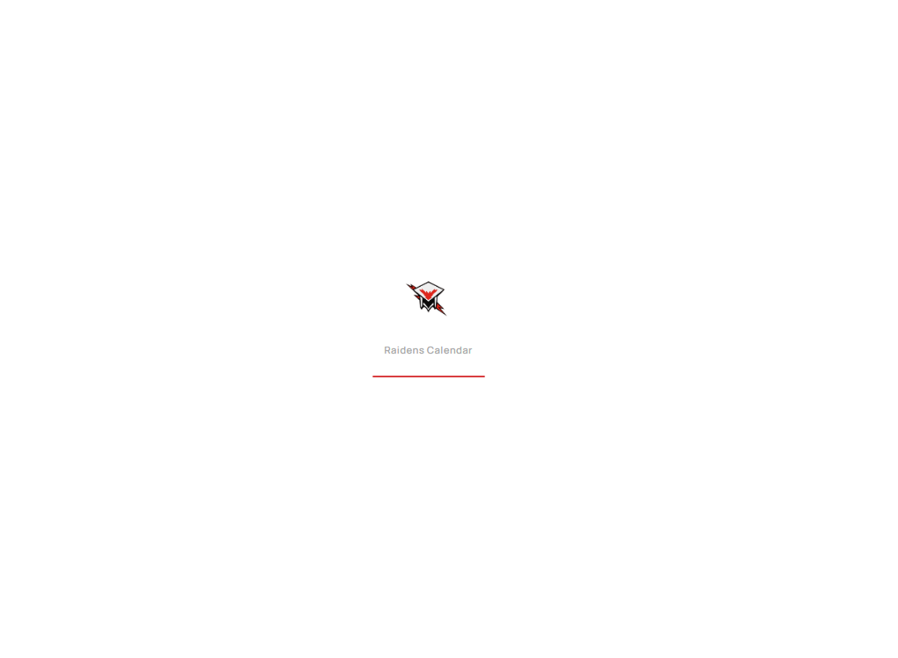
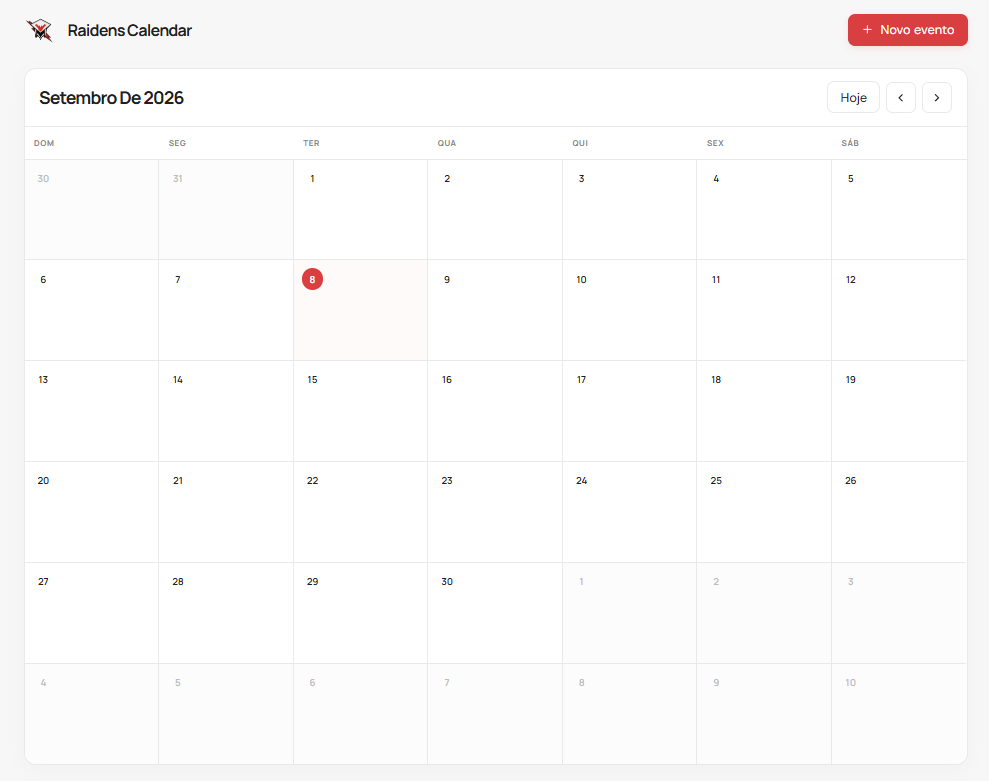
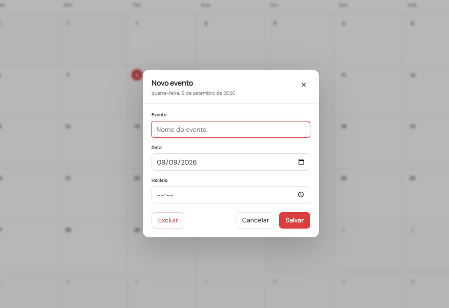

# Raidens Calendar

Calendario de eventos desenvolvido para o SESI Raidens, com interface moderna, responsiva e persistencia de dados local.

---

## Pre-Loader

Ao carregar a pagina, um pre-loader exibe a logo do Raidens com animacao de pulse e uma barra de progresso estilizada, garantindo uma experiencia visual fluida antes do conteudo principal aparecer.

---

## Tela Principal

O calendario exibe a visualizacao mensal completa com navegacao entre meses, indicador do dia atual em destaque e separacao clara dos dias da semana. O botao "Novo evento" permite adicionar compromissos de forma rapida e intuitiva.

---

## Dialog de Novo Evento

O formulario de criacao de eventos permite definir o nome, data e horario do compromisso. A interface inclui opcoes para salvar, cancelar ou excluir eventos ja existentes, com validacao dos campos obrigatorios.

---

## Funcionalidades

- **Calendario mensal** com visualizacao completa de 42 dias (6 semanas)
- **Navegacao entre meses** com setas, botao "Hoje" ou atalhos de teclado (setas esquerda/direita)
- **Criacao e edicao de eventos** com titulo, data e horario
- **Exclusao de eventos** com confirmacao
- **Persistencia local** - todos os dados sao salvos automaticamente no localStorage
- **Pre-loader** com animacao ao carregar a pagina
- **Indicador de salvamento** visual quando um evento e registrado
- **Design responsivo** adaptado para desktop e dispositivos moveis
- **Animacoes suaves** em transicoes de meses, abertura de dialog e interacoes

---

## Estrutura do Projeto

`
RaidensCalendar/
├── index.html          # Arquivo principal com HTML e pre-loader
├── css/
│   └── styles.css      # Estilos completos da aplicacao
├── js/
│   ├── storage.js      # Gerenciamento do localStorage
│   ├── calendar.js     # Renderizacao e navegacao do calendario
│   ├── dialog.js       # Controle do dialog e formularios
│   └── app.js          # Inicializacao e referencias DOM
└── assets/
    ├── PreLoader.png
    ├── TelaDoSite.png
    └── NovoEvento.png
`

---

## Tecnologias Utilizadas

- **HTML5** - Estrutura semantica
- **CSS3** - Variaveis CSS, Flexbox, Grid, animacoes e keyframes
- **JavaScript (ES6+)** - Logica vanilla sem dependencias externas
- **localStorage** - Persistencia de dados no navegador

---

## Como Usar

1. Abra o arquivo index.html em qualquer navegador moderno
2. Aguarde o pre-loader finalizar
3. Navegue entre os meses usando as setas ou o botao "Hoje"
4. Clique em um dia ou no botao "+ Novo evento" para adicionar um evento
5. Preencha os campos e clique em "Salvar"
6. Os eventos sao salvos automaticamente e persistem entre sessoes

---

## Navegacao por Teclado

- **Seta Esquerda** - Ir para o mes anterior
- **Seta Direita** - Ir para o proximo mes

---

## Compatibilidade

- Google Chrome 90+
- Mozilla Firefox 88+
- Microsoft Edge 90+
- Safari 14+

---

**Equipe RAIDENS - SESI Aluminio 192**

